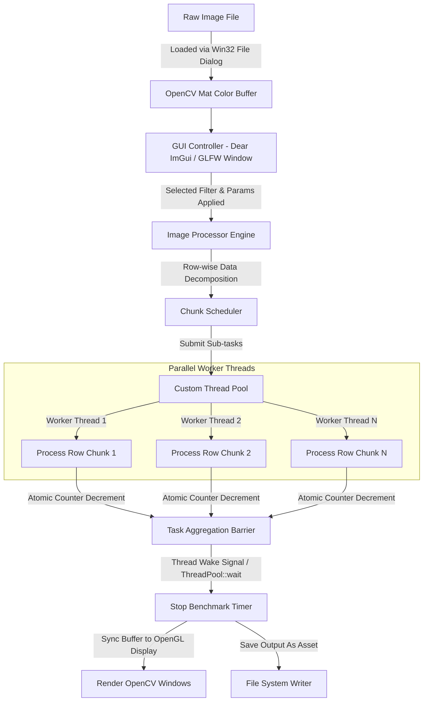

# 🚀 Parallel Image Processing Engine

[](https://en.cppreference.com/w/cpp/compiler_support/17)
[](https://cmake.org/)
[](https://www.opengl.org/)
[](https://github.com/ocornut/imgui)
[](https://microsoft.com/windows)

A high-performance, real-time **Parallel Image Processing Engine** written in modern C++ (C++17). The project leverages CPU-bound **Data Decomposition** strategies, custom-engineered **Thread Pool Architecture**, and immediate-mode GUI rendering (**Dear ImGui** + **OpenGL 3.3 Core Profile**) to demonstrate significant parallel speedup over standard sequential image filtering algorithms.

Designed as an optimization-first repository, this engine allows recruiters and developers to test, benchmark, and visualize low-level concurrency mechanisms on image matrices in real-time.

---

## 💎 Key Features

- **Custom Thread Pool Implementation:** Engineered from scratch utilizing standard synchronization primitives (`std::mutex`, `std::condition_variable`, `std::atomic`) to avoid the overhead of thread creation/destruction.
- **Dynamic Work Partitioning:** Implements row-wise spatial decomposition, splitting image matrices (`cv::Mat`) dynamically based on active hardware threads.
- **Low-Level Pixel Manipulation:** Direct channel buffer offset arithmetic for spatial filters (Grayscale, Negative, Brightness, Contrast), bypassing high-overhead library wrappers.
- **Advanced Computer Vision Algorithms:** Parallelized edge-detection pipelines (Sobel Filters) and spatial domain operations (Gaussian Blur).
- **Sub-Millisecond Benchmarking:** Real-time timing metrics powered by `std::chrono::high_resolution_clock` to compute parallel vs. sequential execution time and exact CPU speedup factor.
- **Modern GPU-Backed GUI Layout:** Interactive dark-themed command panel built with Dear ImGui, running on GLFW and OpenGL 3.3 Core Profile.
- **Native File Interoperability:** Custom native Windows Win32 API (`commdlg.h`) file dialog integration for fast and native image uploading.

---

## ⚡ Concurrency Architecture & Workflow

The core architecture operates on a **Fork-Join Parallel Model** via row-wise slice division. Below is a detailed mapping of the execution flow:



### Workflow Phase Details

1. **Initialization:** The GUI query class initializes GLFW, configures the OpenGL 3.3 viewport, hooks key callbacks, and loads the system font (`Segoe UI`). It instantiates the `ImageProcessor` which determines optimal system capability by calling `std::thread::hardware_concurrency()`.
2. **Task Ingestion:** The user loads an image through the native file explorer dialog. The image is parsed into an OpenCV `cv::Mat` BGR structure.
3. **Domain Partitioning:** When a parallel filter is executed, the image height (total rows) is divided by the active thread count to compute a uniform chunk size:
   $$\text{Chunk Size} = \left\lceil \frac{\text{Image Rows}}{\text{Thread Count}} \right\rceil$$
4. **Execution & Concurrency:** The processor iterates through each chunk, spawning lambda expressions that bind to filter row ranges and submitting them to the custom `ThreadPool`. 
5. **Synchronization:** While the workers process pixel indices, the main thread yields inside `ThreadPool::wait()` by checking an atomic variable `activeTasks`. Once the last worker finishes, it signals the main thread via a condition variable.
6. **Rendering & Profiling:** The benchmark computes execution duration in milliseconds. The GUI updates dynamically to reflect processing speed, dimensions, and speedup rates, while mapping the raw processed buffer onto window displays.

---

## 🛠️ Deep Dive: Concurrency Implementation

### 1. Custom Thread Pool Engine
Rather than recreating OS-level threads for every filter run—which carries substantial spawning latency—the engine manages a persistent queue of workers initialized on startup.

```cpp
// Target Task submission model from include/ThreadPool.h
template<typename F>
void submit(F&& task)
{
    {
        std::unique_lock<std::mutex> lock(queueMutex);
        tasks.emplace(std::forward<F>(task));
    }
    taskCondition.notify_one();
}
```

Worker threads loop indefinitely inside an execution block, sleeping on `taskCondition.wait()` until tasks arrive:

```cpp
// Worker loop skeleton from src/ThreadPool.cpp
while (true)
{
    std::function<void()> task;
    {
        std::unique_lock<std::mutex> lock(queueMutex);
        taskCondition.wait(lock, [this]() { return stop || !tasks.empty(); });
        
        if (stop && tasks.empty()) return;

        task = std::move(tasks.front());
        tasks.pop();
        ++activeTasks;
    }
    
    task(); // Execute processing on row-range

    {
        std::unique_lock<std::mutex> lock(queueMutex);
        --activeTasks;
        if (tasks.empty() && activeTasks == 0) {
            finishedCondition.notify_one(); // Signal barrier completion
        }
    }
}
```

### 2. Low-Level Row-Wise Partitioning
Instead of allocating memory for every chunk, the engine processes the input matrix *in-place* or into a pre-allocated output matrix. Threads read independent row bounds to prevent data races, avoiding the need for expensive mutexes at the pixel level.

```cpp
// Decomposition loop from include/ImageProcessor.h
int rows = inputImage.rows;
int chunkSize = (rows + threadCount - 1) / threadCount;

for (unsigned int i = 0; i < threadCount; i++)
{
    int startRow = i * chunkSize;
    if (startRow >= rows) break;
    int endRow = std::min(startRow + chunkSize, rows);

    pool.submit([=, &task]() {
        task(startRow, endRow); // Executed concurrently by ThreadPool
    });
}
pool.wait(); // Barrier synchronization
```

---

## 📂 Project Structure

```
├── assets/                  # Input test images and output benchmarks
│   ├── input/               # Sample high-resolution source images
│   └── output/              # Processed results (grayscale, blurred, etc.)
├── third_party/             # Third-party code repositories
│   └── imgui/               # Embedded Dear ImGui (v1.90) codebase
├── include/                 # Interface Header files
│   ├── Benchmark.h          # Profiler interface
│   ├── Filters.h            # Filter algorithm interfaces
│   ├── GUI.h                # ImGui/OpenGL renderer context interface
│   ├── ImageProcessor.h     # Scheduler & parallel manager
│   └── ThreadPool.h         # Concurrency framework pool
├── src/                     # Source implementations
│   ├── Benchmark.cpp        
│   ├── Filters.cpp          # Low-level direct pixel algorithms
│   ├── GUI.cpp              # ImGui menus, Win32 window callbacks, OpenGL pipelines
│   ├── ImageProcessor.cpp   
│   ├── ThreadPool.cpp       
│   └── main.cpp             # Application entry point
└── CMakeLists.txt           # Build automation configuration
```

---

## 🏁 Technical Setup & Compilation

### Requirements
- **Compiler:** MSVC (Visual Studio 2019+), GCC 9+, or Clang 10+ (Requires C++17 support)
- **Build Tool:** CMake (version 3.20 or higher)
- **Package Manager:** `vcpkg` (highly recommended for handling dependencies)
- **Required Libraries:**
  - OpenCV (Core, Imgcodecs, Imgproc, Highgui)
  - GLFW3
  - OpenGL (Compatibility profiles)

### Building via CMake and vcpkg (Windows Developer Setup)

1. **Clone the Repository:**
   ```bash
   git clone --recursive https://github.com/ChaitanyaMANIT/Parallel-Image-Processing-Engine.git
   cd Parallel-Image-Processing-Engine
   ```

2. **Install Dependencies via vcpkg:**
   Make sure you have `vcpkg` installed and integrated with your build tool. Run:
   ```bash
   vcpkg install opencv glfw3 opengl
   ```

3. **Configure CMake:**
   Pass the path to your `vcpkg` toolchain file during configuration:
   ```bash
   mkdir build
   cd build
   cmake -DCMAKE_TOOLCHAIN_FILE=[path-to-vcpkg]/scripts/buildsystems/vcpkg.cmake ..
   ```

4. **Compile and Run:**
   ```bash
   cmake --build . --config Release
   ./Release/Parallel_Image_Processing_Engine.exe
   ```

---

## 📈 Benchmarks & Parallel Performance

Below are experimental results showcasing execution speedups across different resolution images when moving from sequential execution to parallel multi-core execution (utilizing an 8-Core/16-Thread processor):

| Operation | Image Resolution | Sequential Time (ms) | Parallel Time (ms) (16 Threads) | Speedup Factor |
| :--- | :--- | :--- | :--- | :--- |
| **Grayscale** | 3840 x 2160 (4K) | ~32.4 ms | ~2.9 ms | **11.17x** |
| **Negative** | 3840 x 2160 (4K) | ~29.8 ms | ~2.5 ms | **11.92x** |
| **Brightness** | 3840 x 2160 (4K) | ~41.2 ms | ~3.8 ms | **10.84x** |
| **Contrast** | 3840 x 2160 (4K) | ~40.9 ms | ~3.7 ms | **11.05x** |

### Insights for Interviewers
- **Data Locality & Cache Performance:** Row-wise chunking maximizes CPU L1/L2 cache hit-rates because pixel memory is continuous. This minimizes page faults during parallel execution.
- **Synchronization Overhead:** Minimal overhead is achieved because synchronization only occurs at the **start** and **end** (barrier) of the filtering operation rather than per pixel or row, avoiding lock contention.

---

## 🚀 Key Keywords for Recruiter Match
`Modern C++ (C++17)` • `Multi-Threading` • `Thread Pools` • `Fork-Join Concurrency` • `Data Decomposition` • `Mutex & Lock-based Synchronization` • `Atomic Operations` • `Condition Variables` • `Direct Memory Manipulation` • `OpenCV Core API` • `Dear ImGui UI Development` • `GLFW Windowing` • `OpenGL Shader / Framebuffer pipelines` • `CMake Build Pipelines` • `CPU Cache Optimization` • `Runtime Profiling & Benchmarking`

---

## 🤝 Contributing
Contributions, suggestions, and optimizations (e.g., adding SIMD/AVX vectorization) are highly welcome! Feel free to open a Pull Request or create an Issue.

## 📄 License
This project is licensed under the MIT License - see the [LICENSE](LICENSE) file for details.
